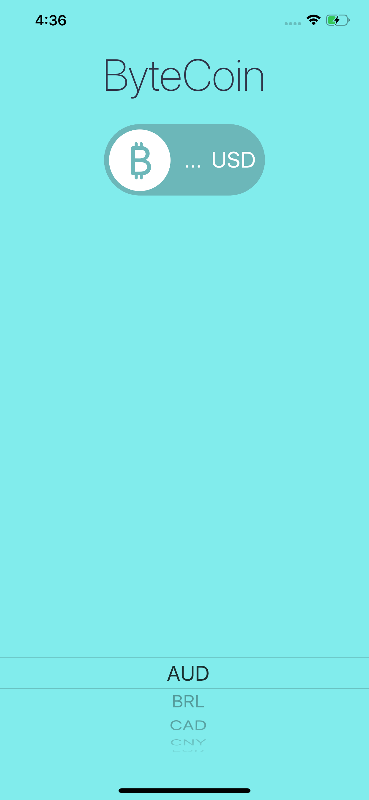
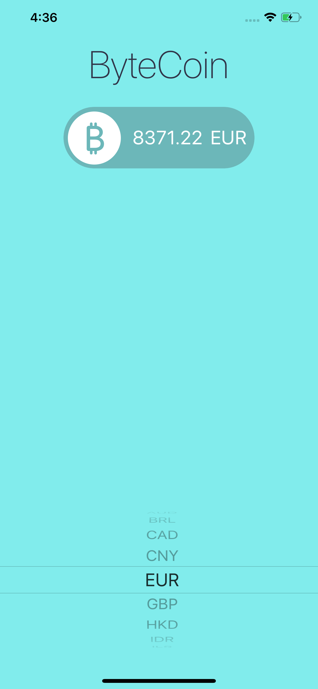

<h1>iOS 13 & Swift 5 - The Complete iOS App Development Bootcamp</h1>
<h5>Networking and API Challenge</h5>

Few concepts were implemented in this challenge including:

<ul>
<li>Protocol & Delegate</li>
<li>Restful API calling with coinapi.io</li>
<li>JSON parser</li>
<li>UI update with Dispatch.main.async</li>
<li>Extension in Swift</li>
</ul>

<h5>Output</h5>

